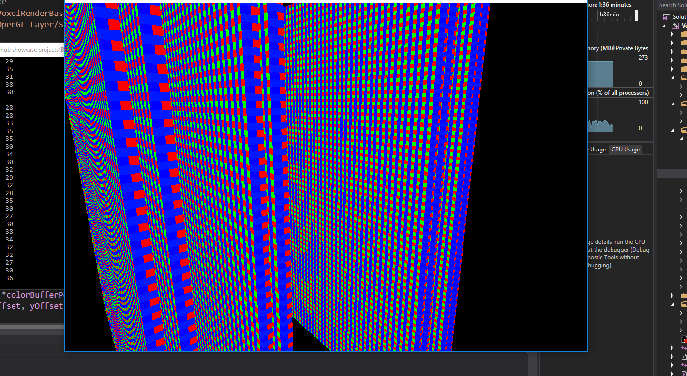

# Software-Occlusion-Octree-Renderer

A Octree/voxel renderer written in C++ which utilizes software occlusion culling. This project was inspired by research done by Intel, https://software.intel.com/en-us/articles/software-occlusion-culling.

This project utilizes SIMD vector instructions in the software occlusion for performance. OpenGL is used to display visible voxels.
This project was created as a personal experiment so I could learn about the feasiblity of combining software occlusion with octree rendering.

